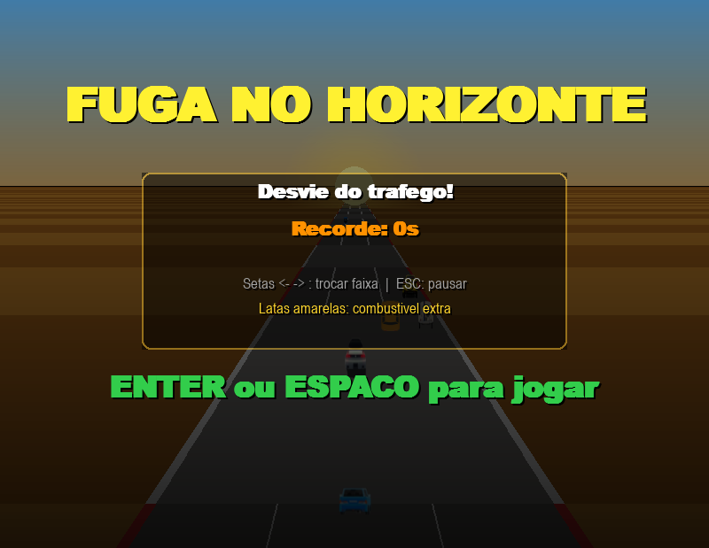

# Fuga no Horizonte

Jogo de corrida pseudo-3D em Python inspirado nos clássicos portáteis dos anos 90. Desvie do tráfego, colete combustível e sobreviva o maior tempo possível.



## Como jogar

```bash
python -m pip install pygame
python jogo.py
```

## Controles

| Tecla | Ação |
|-------|------|
| ← → | Trocar faixa |
| ESC | Pausar / Continuar |
| ENTER / ESPAÇO | Iniciar / Reiniciar |
| Q | Voltar ao menu |

## Funcionalidades

- Estrada pseudo-3D com perspectiva real — strips horizontais que scrollam convergindo ao horizonte
- Carros escalados por profundidade: pequenos no horizonte, grandes perto do jogador
- 5 faixas com marcações perspectivadas
- Sistema de combustível: colete as latas amarelas na pista para reabastecer
- 3 vidas com período de invencibilidade após colisão
- Dificuldade progressiva: velocidade aumenta com o tempo
- Recorde salvo localmente em `highscore.json`
- Screen shake e explosão de partículas na colisão
- Menu principal, tela de pausa e game over

## Requisitos

- Python 3.10+
- Pygame

## Estrutura

```
fuga-no-horizonte/
├── jogo.py           # Código principal
├── highscore.json    # Recorde (gerado automaticamente)
├── pista.png         # Textura de fundo
├── carro1.png        # Carro do jogador
├── carro2-9.png      # Carros inimigos
├── jipe.png          # Jipe inimigo
└── jipe1.png         # Jipe inimigo variante
```
